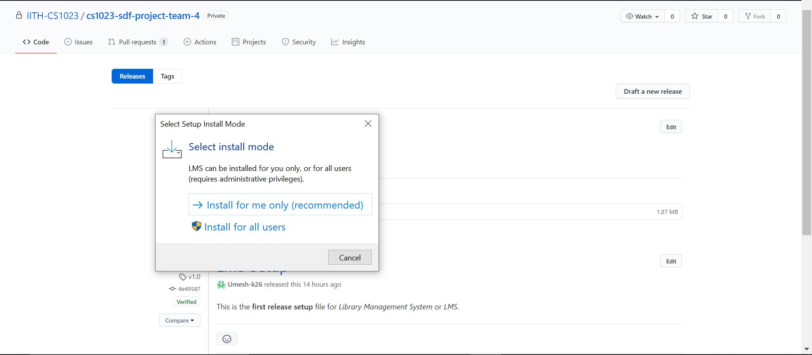
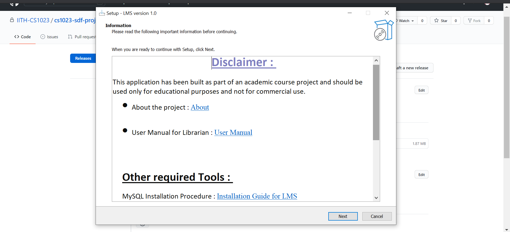
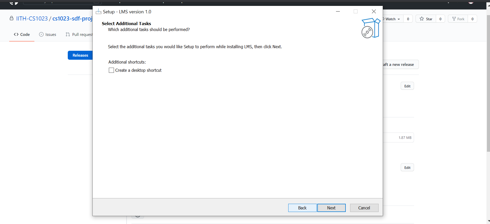
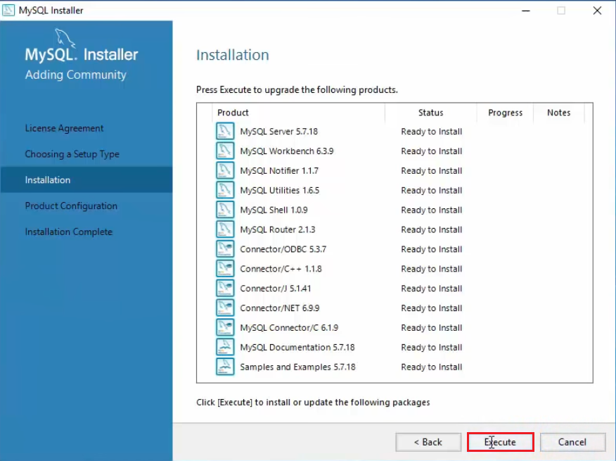
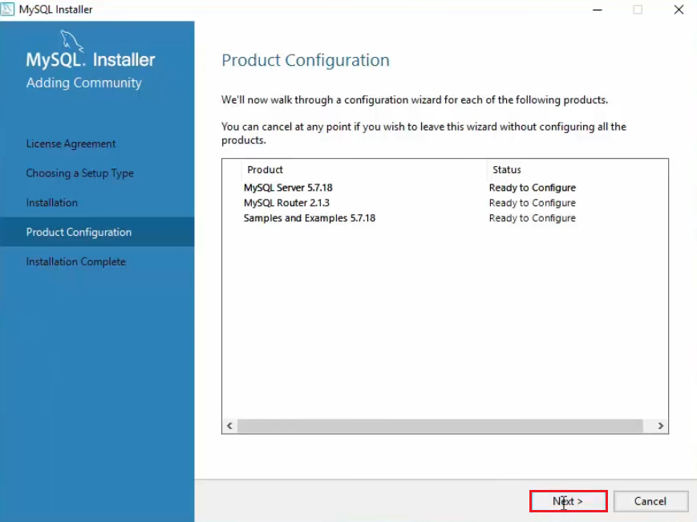
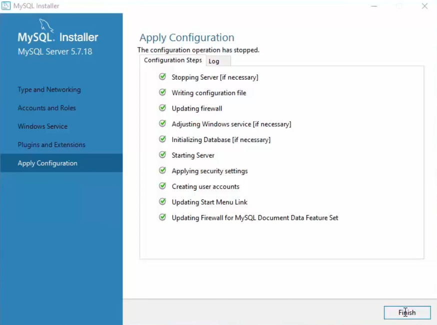
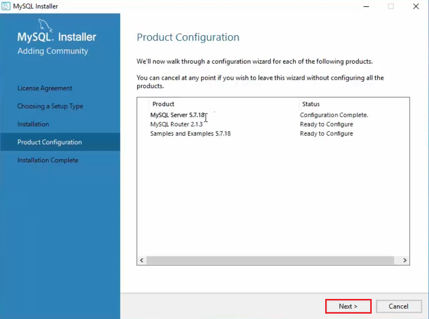
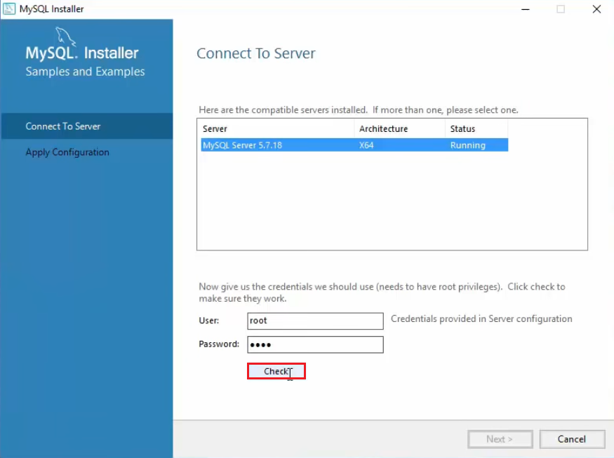
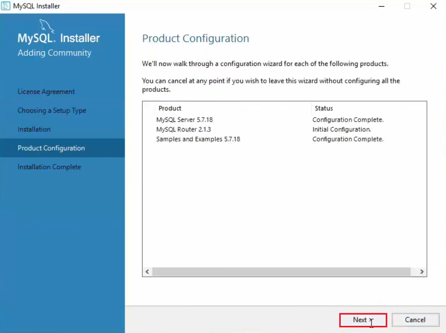

# Library Management System

## Installation Procedure

### Downloading the Application
1. Download the _setup_ file which is ```LMS-setup.exe``` from the [Release](https://github.com/IITH-CS1023/cs1023-sdf-project-team-4/releases) Section
    - If your system shows a Warning Box then just click on _Run Anyway_ or change settings to Run any application
2. Run the Application
3. Choose the required setting

3. Read the **Disclaimer** and other information provided

4. Install [MySQL Database](#Downloading-MySQL-Database) by following the intructions
5. After reading the **Disclaimer**, Click on _Next_
6. The application will be installed by default on _Desktop_ and click on _Next_
7. If you need to create a _Desktop Icon_ click on the checkbox and click on _Next_

8. Click on _Install_
9. After the application is installed your SuperUser username and password will be displayed along with other information

Note that the installation directory looks like this: 
```
images
MySQL Library Database
LMS.exe
LMS.exe.metagen
LMS.pdb
MySql.Data.dll
unins000.dat
unins000.exe
```

### Downloading MySQL Database
Install MySQL Community Version from the official website [MySQL installer for Windows](https://dev.mysql.com/downloads/windows/installer/). <br>

#### Installation
- Download installer from above link and run the installer.
- Accept the license agreement.
- Choose **Developer Default** setup type and click next.
- Click **Execute** to install MySQL products

    </img>
- Click **Next** for _Product Configuration_ settings.

    </img>

#### Configuration
- In _Type and Networking_, choose **Standalone MySQL Server/Classic MySQL Replication** and click **Next**.
- Leave it as default in _Server Configuration Type_ settings.
- Set a _Root Account Password_.
- Add a user with Database role as _DB Admin_ and click **Next**.
- Leave it as default in _Windows Service_ and _Plugins and Extensions_ settings.
- Now click **Execute** to _Apply Server Configuration_.

    </img>
- For _Router Confiugration_, leave it as default and click next.

    </img>
- For configuring _Samples and Examples_, choose server and check connection with **Check** Button

    </img>
- Click **Next** and **Execute** to finish confiugration settings.

    </img>
    
- > **_NOTE:_**  Follow [How To Install MySQL on Windows 10 ](https://youtu.be/WuBcTJnIuzo?t=259) for detailed tutorial on installation and configuration.

### Setting up Database

To set up the database follow the steps

1. Open _MySql WorkBench_ and click on the highlighted button and login with the _root password_ you have set during _MySql Configuration_ to make a database connection with username being _root_, host as _localhost_ and port no. _3306_.

    You can always make a new connection in **Database -> Manage Connections**.

    </img>
2. Now go to **File -> Open SQL Script** and navigate to ```MySQL Library Database\library_system_db.sql``` from the installation directory shown above and click _Open_

    </img>
3. Now click on the highlighted button to _Run_ the script

    </img>
4. Database is setup successfully

## Running the Application

> **_NOTE:_** When running the application for the first time, you will be required to input your UserName and Password for MySQL Database
- In the installation directory, click ```LMS.exe``` to run the application
- Enter _MySQL user credentials_ in the highlighted input boxes so that application can access the database locally before logging in as a _Librarian_

    </img>

    </img>
- Now _Sign In_ into the application with the credentials shown in the information shown just after installing **LMS** application.

### After Installation Guide
Now the application has been installed.
- Refer [User Manual (Librarian)](https://github.com/IITH-CS1023/cs1023-sdf-project-team-4/blob/main/docs/User-Manual-(Librarian).md) to learn more about using the application.

- Refer [Features](https://github.com/IITH-CS1023/cs1023-sdf-project-team-4/blob/main/docs/Features.md) for features provided by the application.

Thank you!! 
