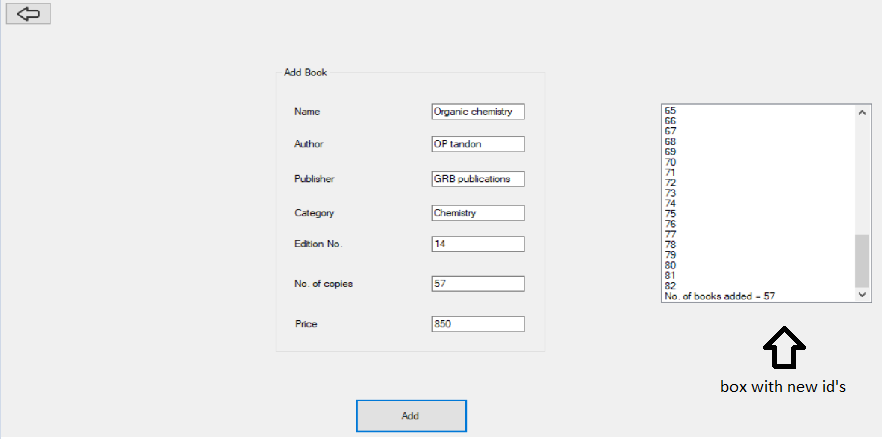

# Library Management System

## User Manual (As a Librarian)

| Table of contents |
|------------------|
|[Logging In](#logging-in) |
|[Registering a New Member](#Registering-a-New-Member) |
|[Adding a New Book to the Library](#Adding-a-New-Book-to-the-Library) |
|[Registering a New Librarian](#Registering-a-New-Librarian) |
|[Display List of All Books](#Display-List-of-All-Books) |
|[Display List of All Members](#Display-List-of-All-Members) |
|[Display History of Borrowing for All Members](#Display-History-of-Borrowing-for-All-Members) |
|[Borrowing a Book from the Libary](#Borrowing-a-Book-from-the-Libary) |
|[Returning a Borrowed Book](#Returning-a-Borrowed-Book) |
|[Search for a Particular Book](#Search-for-a-Particular-Book) |
|[Search for a Particular Member](#Search-for-a-Particular-Member) |
|[Search for a Particular Order ID (Issue ID)](#Search-for-a-Particular-Order-ID-Issue-ID) |
|[Update or Delete Profile of a Book](#Update-or-Delete-Profile-of-a-Book) |
|[Update or Delete Profile of a Member](#Update-or-Delete-Profile-of-a-Member) |
|[Change Password of a Member](#Change-Password-of-a-Member) |
|[Logging Out](#Logging-Out) |
|[Exiting the Application](#Exiting-the-Application) |

### Logging In
- To log in, enter your _Username_ and _Password_ in the respective fields
- Click on **Login Button** and the application will authenticate if you are a Librarian or not
- If either the _Username_ does not exist or the _Password_ is invalid then it shows an **ERROR Message**
- Upon successful authentication, the Home Page opens up with the required Interface for a Librarian

### Registering a New Member
- To register a _New Member_, from Home Page click on the **Register a Member** Button.
- Fill in all the fields properly and click on Register
- If there is an error in any of the fields then an error message will be displayed
- Upon successful registration, a **Message Box** with your **Username** will be displayed, and please note the same

### Adding a New Book to the Library
- To Add a _New Book_, from Home Page click on the **Add Book to Library** Button.
- Fill in all the fields properly and click on **Add Book**
- If there is an error in any of the fields then an error message will be displayed
- Upon successful operation, a box with all new IDs of the books added will be **displayed**, and please note the same

### Registering a New Librarian
- To register a _New Librarian_, from Home Page click on the **Register a Librarian** Button.
- Fill in all the fields properly and click on **Register**
- If there is an error in any of the fields then an **ERROR Message** will be displayed
- Upon successful registration, a Message Box with your **Username** will be displayed, and please note the same

### Display List of All Books
- To display the _List of All Books_ in the library, from Home Page click on the **List of Books** Button
- This will open the page and send queries to SQL Database
- A Datagrid with all the information about the books will be filled

### Display List of All Members
- To display the _List of All Members_ in the library, from Home Page click on the **List of Members** Button
- This will open the page and send queries to SQL Database
- A Datagrid with all the information about the Members will be filled

### Display History of Borrowing for All Members
- To display the _History of All Borrows_ by all the members, from Home Page click on the **Borrow History** Button
- This will open the page and send queries to SQL Database
- A Datagrid with all the information about the History will be filled

### Borrowing a Book from the Libary
- To _Borrow a Book_, from Home Page click on the **Borrow A Book** Button.
- Fill in the correct Member ID and Book ID and click on the **Borrow** Button
- Upon any form of error such as Membership Status is Deactivated, or Book of the ID is not available for borrowing, or any other such situation, a Message Box will be displayed indicating the error
- Upon successful operation, a Message Box with Member ID, Book ID, and Order ID (or you Issue ID) will be displayed

### Returning a Borrowed Book
- To _Return a Book_, from Home Page click on the **Return A Book** Button.
- Fill in the correct _Order ID_ and click on the **Return** Button
- Upon any form of error such as Book already being returned, or invalid Order ID, or any other such situation, a Message Box will be displayed indicating the error
- Upon successful operation, a Message Box with Member ID, Book ID, and Order ID (or you Issue ID) will be displayed along with the Fine that needs to be paid if applicable

### Search for a Particular Book
- To search for a Book, from the List of Books Page, search for the book in the Datagrid Table which has listed the information of all the books in the Library
- To filter the results, select any one of the fields from the Drop Down List as _ID_, _Title_, _Author_, _Edition No._, then enter the text in the text box and click on the **Search** Button
- The application will send a query to the Database and filtered results will be produced in the Datagrid
- To open the profile of the book, click on the **Open** Button under Profile Column
- To clear search results, click on the **Clear Search** Button

### Search for a Particular Member
- To search for a Member, from the List of Members Page, search for the Member in the Datagrid Table which has listed the information of all the Members of the Library
- To filter the results, select any one of the fields from the Drop Down List as _ID_, _Name_, _Phone_, _Email_, _Number of books borrowed currently_, then enter the text in the text box and click on the **Search** Button
- The application will send a query to the Database and filtered results will be produced in the Datagrid
- To open the profile of the Member, click on the **Open** Button under Profile Column
- To clear search results, click on the **Clear Search** Button

### Search for a Particular Order ID (Issue ID)
- To search for an Order ID, from Borrow History Page, search for the Order ID in the Datagrid Table which has listed the information of all the Order IDs of the Books Borrowed and Returned in the Library
- To filter the results, select any one of the fields from the Drop Down List as _Order ID_, _Member ID_, _Book ID_, then enter the text in the text box and click on the **Search** Button
- The application will send a query to the Database and filtered results will be produced in the Datagrid
- To open the profile of the Order ID, click on the **Open** Button under Profile Column
- To clear search results, click on the **Clear Search** Button

### Update or Delete Profile of a Book
- To update or delete the Profile of a Book, from the List of Books Page, Open the Profile of the Book you wish to update or delete
- To Update, click on the **Update Profile** button, and a new **Make Changes** button will appear
- An option to increase the number of copies of the Book is provided, use the Textbox to input the number of new copies to be added and then click on **Make Changes**
- After clicking the profile page will load again and the Datagrid table inside the Profile page will show the updated copies and details
- To Delete, click on the **Delete Profile** button, a Warning Box will be displayed
- Click on **OK** to proceed, or **Cancel** if you wish to cancel, then a Message Box will be displayed to pay the fine, and the profile will be deleted

### Update or Delete Profile of a Member
- To update or delete the Profile of a Member, from the List of Members Page, Open the Profile of the Member you wish to update or delete
- To Update, click on the **Update Profile** button, and a new **Make Changes** button will appear
- Make necessary changes to the profile such as mobile number, email, address, or profession, and click on Make Changes
- After clicking the profile page will load again with updated details
- To Delete, click on the **Delete Profile** button, a Warning Box will be displayed
- If the Member has not returned all the borrowed books then an error message will be displayed stating the error, else click on **OK** to proceed, or **Cancel** if you wish to cancel, and the profile will be deleted

### Change Password of a Member
- To Change the Password of a Member, from the List of Members Page, Open the Profile of the Member you wish to change
- Click on the **Update Password** button, and enter the new password
- Click on **Confirm New Password** and a Warning Box will be displayed stating that the password will be changed
- Click on **OK** to proceed, or **Cancel** if you wish to cancel, then the password will be updated

### Logging Out
- From the Home Page, click on the **Logout** button
- You will be logged out and the Sign In page will be opened
.png)

### Exiting the Application
- If you are on the Sign In page then the Application can be directly closed by clicking on the top right corner **Close** button
- If you are on any other Page then, if there is an **Exit** button clicking on that will Exit the Application
