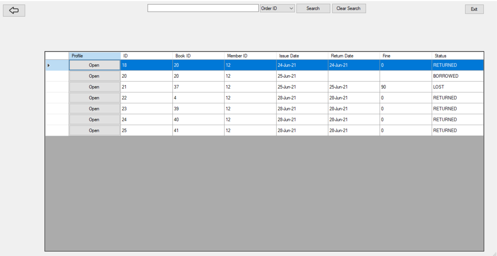
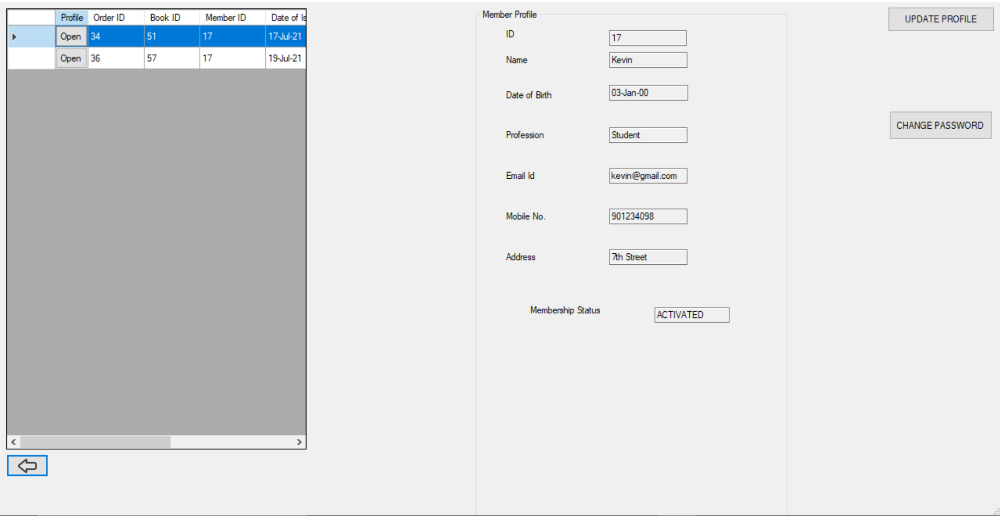
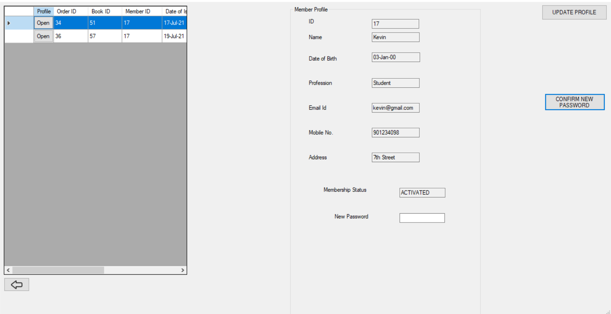

# Library Management System
## As a Member
| Table of contents |
|------------------|
|[Logging In](#logging-in) |
|[Display List of All Books](#Display-List-of-All-Books) |
|[Display History of Borrowing](#Display-History-of-Borrowing) |
|[Search for a Particular Book](#Search-for-a-Particular-Book) |
|[Search for a Particular Order ID (Issue ID)](#Search-for-a-Particular-Order-ID-Issue-ID) |
|[Update Your Profile](#Update-Your-Profile) |
|[Change Password](#Change-Password) |
|[Logging Out](#Logging-Out) |
|[Exiting the Application](#Exiting-the-Application) |

### Logging In
- To log in, enter your _Username_ and _Password_ in the respective fields
- Click on **Login Button** and the application will authenticate if you are a Member or not
- If either the _Username_ does not exist or the _Password_ is invalid then it shows an **ERROR Message**
- Upon successful authentication, the Home Page opens up with the required Interface for a Member

### Display List of All Books
- To display the _List of All Books_ in the library, from Home Page click on the **List of Books** Button
- This will open the page and send queries to SQL Database
- A Datagrid with all the information about the books will be filled

### Display History of Borrowing
- To display the _History of All Borrows_ by you as a Member, from Home Page click on the **Borrow History** Button
- This will open the page and send queries to SQL Database
- A Datagrid with all the information about the History will be filled

### Search for a Particular Book
- To search for a Book, from the List of Books Page, search for the book in the Datagrid Table which has listed the information of all the books in the Library
- To filter the results, select any one of the fields from the Drop Down List as _ID_, _Title_, _Author_, _Edition No._, then enter the text in the text box and click on the **Search** Button
- The application will send a query to the Database and filtered results will be produced in the Datagrid
- To open the profile of the book, click on the **Open** Button under Profile Column
- To clear search results, click on the **Clear Search** Button

### Search for a Particular Order ID (Issue ID)
- To search for an Order ID, from Borrow History Page, search for the Order ID in the Datagrid Table which has listed the information of all the Order IDs of the Books Borrowed and Returned in the Library by your Member ID
- To filter the results, select any one of the fields from the Drop Down List as _Order ID_, _Member ID_, _Book ID_, then enter the text in the text box and click on the **Search** Button
- The application will send a query to the Database and filtered results will be produced in the Datagrid
- To open the profile of the Order ID, click on the **Open** Button under Profile Column
- To clear search results, click on the **Clear Search** Button

### Update Your Profile
- To update your profile, from the _Home Page_, click on the **View Profile** Button
- To Update, click on the **Update Profile** button, and a new **Make Changes** button will appear
- Make necessary changes to the profile such as mobile number, email, address, or profession, and click on **Make Changes**
- After clicking, the profile page will load again with updated details

### Change Password 
- To Change your Password, from the _Home Page_, click on the **View Profile** Button
- Click on the **Update Password** button, and enter the new password
- Click on **Confirm new Password** and a Warning Box will be displayed stating that the password will be changed
- Click on **OK** to proceed, or **Cancel** if you wish to cancel, then the password will be updated

### Logging Out
- From the Home Page, click on the **Logout** button
- You will be logged out and the Sign In page will be opened
.png)

### Exiting the Application
- If you are on the Sign In page then the Application can be directly closed by clicking on the top right corner **Close** button
- If you are on any other Page then, if there is an **Exit** button clicking on that will Exit the Application
